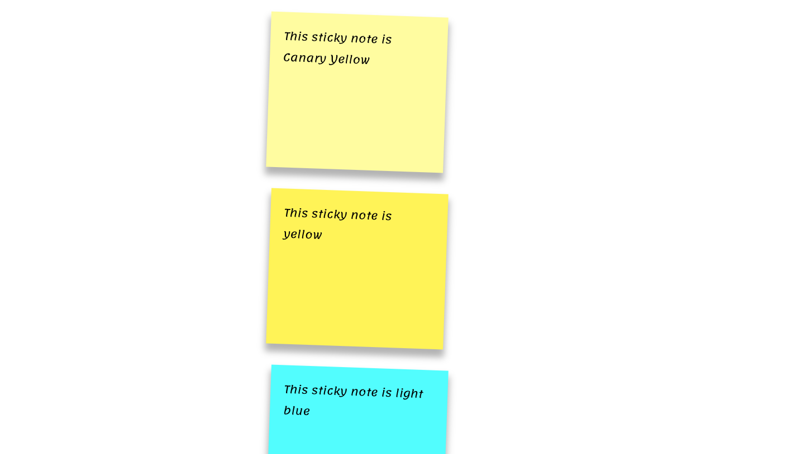

# sticky_notes

This is a basic template that can be used to create sticky notes. It is built with only html and css. No images are loaded at all. It is also a clean setup that is responsive and should adjust text and size based on screen width.

Link to deployed app: https://crowandrew.github.io/sticky_notes/

